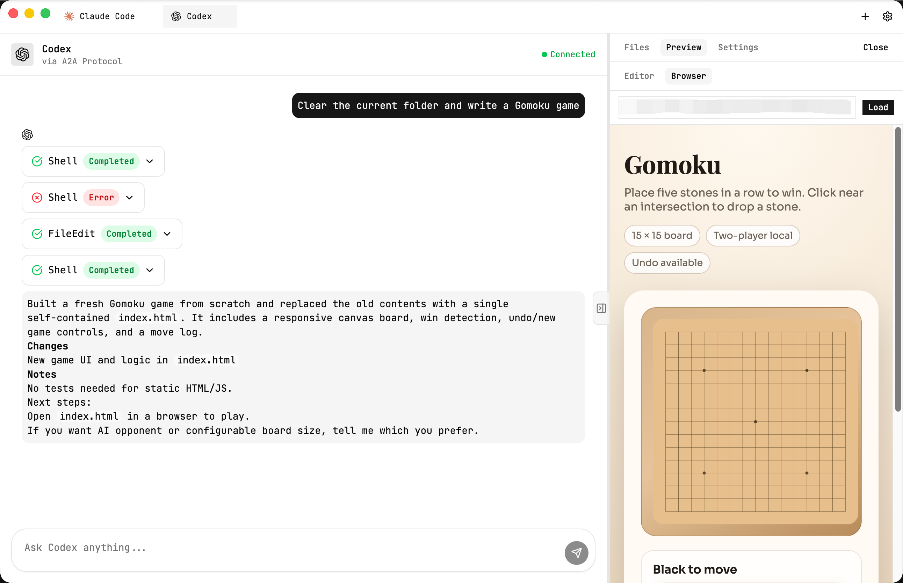

# Conflux

A unified AI Agent desktop client that brings Claude Code, Codex, Gemini CLI and other AI coding assistants together in one application.

## Features

- **Multi-Agent Tab Management** - Run multiple AI Agents simultaneously in one window, switch between them like browser tabs
- **Unified Experience** - Consistent interface and interactions across all Agents
- **Quick Agent Switching** - Launch different AI Agents with one click from the New Tab page
- **A2A Protocol Streaming** - Connect over A2A with status updates and artifact streams
- **Structured Tool Rendering** - Shell commands, file edits, web searches, and todo lists render as tool cards
- **Artifact Attachments** - Streamed tool output and artifacts are shown as attachments
- **Reasoning View** - Collapsible reasoning blocks for agent thought streams
- **Project-Aware Codex Sessions** - Per-project settings (sandbox, network, web search, approval policy)
- **Right-Side Workspace Panel** - File tree, previews, and settings in a resizable panel
- **Editable File Preview** - CodeMirror editor with dirty state and save button
- **Local HTML Preview** - Auto-open HTML files in the Browser tab via a custom protocol
- **Live File Refresh** - File tree auto-updates using a native watcher

## Screenshot



## Getting Started

```bash
# Install dependencies
pnpm install

# Start development mode
pnpm dev

# Build application
pnpm build

# Package for distribution
pnpm build:dist
```

## Supported Agents

| Agent | Provider | Description |
|-------|----------|-------------|
| Claude Code | Anthropic | CLI coding assistant |
| Codex | OpenAI | Code generation agent |
| Gemini CLI | Google | Terminal AI agent |

## Roadmap

### Dynamic UI Rendering
- [ ] Agents can dynamically generate interactive UI components based on task context
- [ ] Support for forms, buttons, code previews and other rich interface elements
- [ ] Progressive loading with smooth display of Agent's reasoning and execution process

### Multi-Agent Collaboration
- [ ] Agents can invoke each other and hand off tasks
- [ ] Split complex tasks across multiple Agents for parallel processing
- [ ] Unified task status tracking and result aggregation

### Agent Adapters
- [x] Claude Code full integration
- [x] Codex full integration
- [x] Gemini CLI full integration
- [ ] Custom Agent onboarding support

> I only have a Codex account at the moment, so Claude Code / Gemini CLI are expected to work but not fully verified yet. Contributions and validation are welcome.
